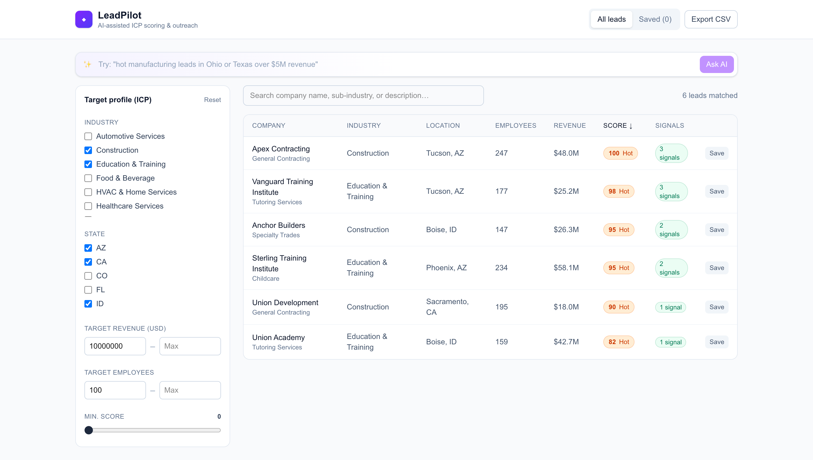
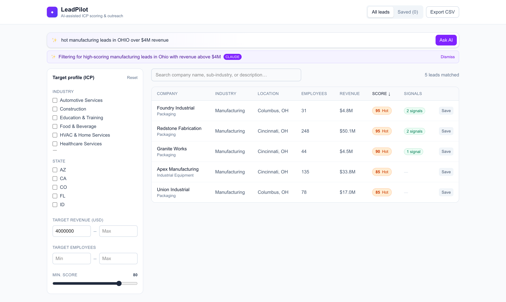
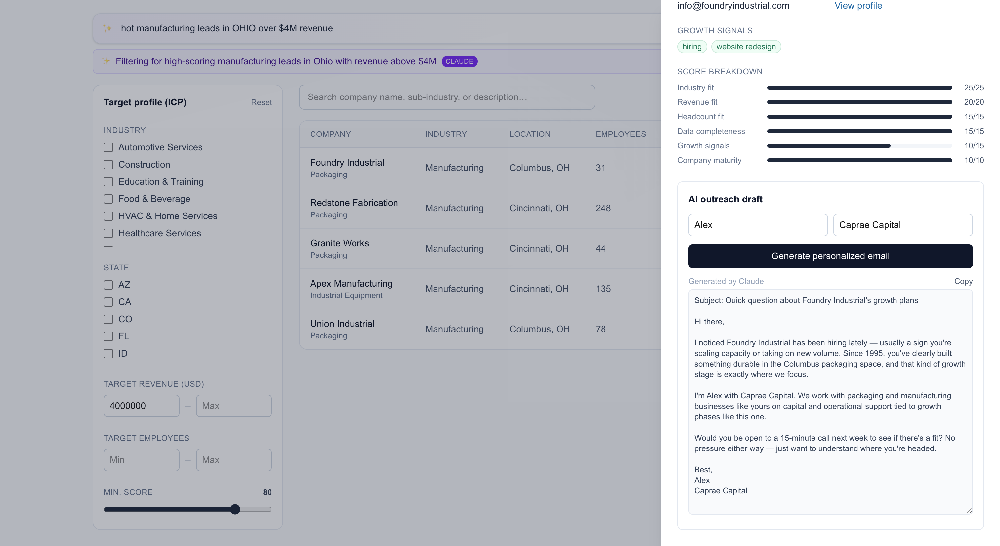
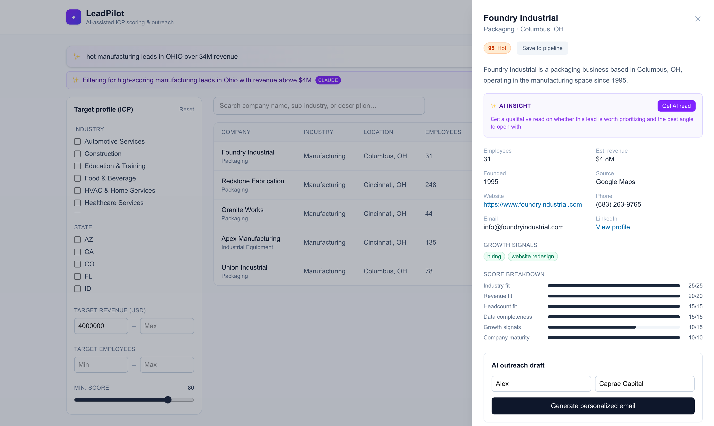

# LeadPilot

An enhancement built on top of the [SaaSquatch Leads](https://www.saasquatchleads.com/) concept for the Caprae Capital Full Stack Developer pre-work challenge — a lead-generation dashboard that layers **three AI-powered features** and a **transparent ICP-fit scoring engine** on top of the core scrape → enrich → save → export workflow.

**Live demo:** [caprae-capital-gilt.vercel.app](https://caprae-capital-gilt.vercel.app)

## The problem this solves

SaaSquatch (and tools like it) are very good at the *volume* side of lead gen: scrape a lot of company data, enrich it, dump it in a dashboard. The bottleneck for a sales team (or a search-fund/PE deal team doing acquisition sourcing — which is literally how Caprae uses its own SaaSquatch tool internally) isn't finding leads, it's **finding the right leads fast, knowing which of the 300 in front of you to work first, and getting a first-touch message out the door quickly**.

This project picked **one feature area and went deep on it** (the "Quality First" path in the handbook) rather than shipping several shallow tools. Three real LLM integrations, each used where an LLM is actually the right tool (never for numeric scoring — see **Design decisions**):

1. **Natural-language lead search.** Type `"best manufacturing leads in Ohio or Texas over $5M revenue"` into one box instead of hand-configuring six filter controls. Claude parses it into structured filters via **tool use**, constrained to the real industry/state values in the dataset so it can't invent a filter that doesn't exist. No API key configured? A regex/keyword fallback parser covers the common patterns so the feature never just stops working.
2. **AI lead insight.** A qualitative, 2–3 sentence read on any lead — is it actually worth prioritizing, what's the risk, what's the single best angle to open with — reading the company profile the way an experienced SDR would, not just restating the score breakdown in prose.
3. **AI-drafted outreach.** One click generates a short, specific, non-generic cold email for any lead, grounded in that company's actual profile and growth signals.
4. **ICP-Fit Scoring Engine** (the deterministic backbone all three AI features sit on top of) — every lead gets a transparent 0–100 score against a target profile you define, broken into 6 explainable sub-scores (industry match, revenue fit, headcount fit, data completeness, growth signals, company maturity).

Every AI feature degrades to a deterministic fallback with no API key configured — the app is fully functional, just less flexible, out of the box.

## Why this aligns with the business

- **Prioritization over volume**: scoring surfaces the leads worth a rep's time first, instead of a flat list of hundreds of rows; natural-language search gets there in one query instead of six filter interactions.
- **Time-to-first-touch**: outreach drafting collapses "research the company → write a personalized opener" from ~10 minutes to one click; the insight card collapses "read the profile and decide if it's worth it" the same way.
- **Explainability**: the score breakdown is a deliberate choice — a sales team (or a deal team) needs to trust and defend prioritization decisions, so the scoring is a readable rules engine, not an opaque model. The AI features are additive judgment on top, clearly labeled as AI-generated, never the thing deciding rank order.
- **Dual use case**: the same ICP-matching engine that ranks leads for outbound sales works unchanged as an acquisition-target screener (industry / revenue / headcount fit is exactly the first-pass filter a search fund uses on deal flow), which maps directly to how Caprae uses its own sourcing tool.

## Screenshots

Captured against the live deployment, real Claude output included (not the template fallback).

| | |
|---|---|
|  | **Dashboard** — leads ranked by ICP-fit score, filterable by industry/state/revenue/employees. |
|  | **Natural-language search** — a plain-English query parsed into structured filters via Claude tool use. |
|  | **AI outreach draft** — a personalized cold email generated from the lead's actual profile and growth signals. |
|  | **Score breakdown & AI insight** — every point in the score is explainable, plus a qualitative AI read on the lead. |

## Tech stack

| Layer | Choice | Why |
|---|---|---|
| Framework | Next.js 16 (App Router, TypeScript) | Single deployable app for both the UI and the API — no separate backend service to stand up or CORS to manage. |
| UI | React + Tailwind CSS | Fast to build a clean, information-dense dashboard without a component library dependency. |
| Data fetching | SWR | Handles request de-duping, caching, and loading/revalidation state on the client without hand-rolled `useEffect` fetch logic. |
| Database | SQLite (`better-sqlite3`), file-based | Zero external services for a reviewer to spin up — `npm install && npm run dev` just works. Synchronous driver keeps API route code simple. See **Data storage** below for the production path. |
| Caching | In-memory LRU (`lru-cache`) | A short-TTL (60s) query cache for filtered lead searches, plus a long-TTL (24h) cache per AI feature (outreach, insight) keyed by lead+context — avoids re-paying for an LLM call on the same request. |
| AI | Anthropic API (`@anthropic-ai/sdk`), `claude-sonnet-4-5`, one shared client (`lib/ai-client.ts`) | Used for natural-language search (tool use), outreach copywriting, and lead insight generation — three places a generative model adds real value. Lead *scoring* stays rule-based and explainable — see **Design decisions**. |
| Validation | Zod | Request body validation on every POST route. |
| Rate limiting | In-memory fixed-window limiter (`lib/rate-limit.ts`) | Every route that can call the LLM (outreach, insight, nl-search) is capped per client (20 req/min) — without it, one client hammering an endpoint burns API budget with no upside. |

### Data storage

SQLite is the right choice for this deployment (a single-process demo/review app with a ~300-row table), but it is a filesystem-backed database, which doesn't survive across serverless function instances. The repository layer (`src/lib/leads-repo.ts`, `src/lib/db.ts`) is the only place that talks to the database, so moving to production means:

- Swap `better-sqlite3` for a serverless-friendly Postgres driver (e.g. [Neon](https://neon.tech) or [Supabase](https://supabase.com), both have generous free tiers and HTTP-based drivers that work from edge/serverless functions).
- Keep the same query shapes — the `queryLeads` / `getLeadById` / `toggleSaved` function signatures don't need to change, only their implementation.
- Add a `pg`-based migration for the two tables in `db.ts`'s `seed()` function.

### Caching

The in-memory LRU cache works because this runs as one long-lived Node process. On serverless (Vercel functions, AWS Lambda), each cold-started instance has its own memory, so the cache hit rate would collapse. Production fix: swap `src/lib/cache.ts` for [Upstash Redis](https://upstash.com) (HTTP-based, serverless-friendly, has a free tier) behind the same `cachedQuery` / `makeAiCache` interface — call sites don't change. The rate limiter (`lib/rate-limit.ts`) has the identical constraint and the identical fix: it's correct for one instance, and would move to Redis-backed counters to enforce limits across instances.

### Hosting & deployment

Designed to deploy as:
- **Frontend**: static/edge-rendered by Next.js on Vercel's CDN (the dashboard itself has no server-only data at build time).
- **Backend**: the `src/app/api/*` routes deploy as serverless functions automatically on Vercel — no separate backend to provision.
- **Cloud provider**: Vercel (built on AWS under the hood) for the fastest path to a working deployment; the app also ships with a standard `next build` output so it runs identically in a Docker container on AWS (App Runner/ECS), GCP Cloud Run, or Azure Container Apps if a specific cloud is required — only the database/cache drivers noted above would need to point at that provider's managed Postgres/Redis instead of Neon/Upstash.

**Two things had to be handled specifically for Vercel, not just "any Node host":**
- `next.config.ts` marks `better-sqlite3` as a `serverExternalPackage` — without it, Next's bundler can't handle the compiled native binary and Vercel's function tracer won't include it in the deployed bundle, so the deployed function fails at runtime even though `next build` succeeds locally.
- `db.ts` writes to `/tmp` instead of a path under the deployment bundle when `process.env.VERCEL` is set, since everywhere else in the bundle is read-only at runtime. This keeps the app from crashing, but `/tmp` is ephemeral: **the "Saved to pipeline" feature's persistence isn't reliable across cold starts or concurrent instances on Vercel's default serverless tier.** The leads dataset itself (search/filter/score/export) is unaffected, since it's deterministically reseeded from the bundled CSV every time. Real persistence for saved leads needs the Postgres migration described above — this is a known, documented limitation of this deployment, not a hidden bug.

Deployed live on Vercel — see **Live demo** above. No Neon/Upstash (Postgres/Redis) account was created; the live deployment runs on the SQLite + in-memory setup described here, with the persistence caveat noted above. The app also runs fully locally per the setup instructions below.

## Design decisions

- **Scoring is a rules engine, not an LLM call.** Numeric prioritization needs to be fast, cheap (no API cost per lead in a list of hundreds), deterministic, and defensible to a sales manager who asks "why is this lead ranked #3?". An LLM is the wrong tool for that; it's the right tool for parsing a search query, writing prose, and giving a qualitative read — which is where the three AI features are actually used.
- **Every AI feature degrades gracefully.** No `ANTHROPIC_API_KEY` set? Natural-language search falls back to a regex/keyword parser, outreach and insight generation fall back to deterministic templates — the app never hard-fails because a key is missing, it just gets less flexible.
- **Natural-language search uses tool use, not free-form JSON parsing.** The `set_lead_filters` tool's schema constrains `industries`/`states` to an `enum` built from the *real* distinct values in the dataset (`getMeta()`), so Claude structurally cannot return a filter value that doesn't exist — no prompt-and-hope JSON parsing, no post-hoc validation needed.
- **The heuristic fallback parser had two real bugs worth calling out**, because they're the kind of thing that only shows up once you actually test multi-attribute input:
  - A shared-scoping regex (`[^.]*keyword[^.]*`) meant to isolate "the part of the query about revenue" vs. "the part about employees" would silently match the *entire* query whenever there was no period in it (which is always, for a search box) — so `"between 10 and 50 employees ... revenue over $1M"` had its employee range bleed into the revenue filter. Fixed by making money and employee-count mentions self-disambiguating by shape instead (money always carries a `$` or a magnitude word; a bare integer next to "employees" doesn't), so both parsers can scan the whole query independently with no scoping logic needed at all.
  - State-code matching on `/\b[A-Z]{2}\b/` treated the query `"...in OH or TX..."` as also matching **OR** (Oregon) and **IN** (Indiana) — connector words that happen to collide with real state abbreviations. Fixed with a full state-name map (so "Oregon"/"Indiana" spelled out still matches) and a short block-list of the specific codes known to collide with common English words, which fall back to requiring the full name.
  
  Both are covered by regression tests in `ai-search.test.ts` — see **Testing**.
- **Synthetic dataset, disclosed.** `data/leads.csv` (320 rows) is generated by `scripts/generate-dataset.mjs` — it's synthetic (no real companies, no real PII), seeded deterministically, shaped to look like real scraped output (industry, location, revenue estimate, employee count, growth signals, contact info) so the scoring/filtering/export pipeline has something realistic to operate on without scraping live sites or depending on a paid enrichment API key for the submission to run.
- **Not implemented: live scraping at scale.** This submission uses the synthetic, bundled dataset above rather than scraping real sites — nothing below is built, this is the approach a real version would take, stated plainly so it isn't confused with a shipped capability. Respect each site's `robots.txt` and rate limits, with exponential backoff and retry on 429/503 responses rather than hammering through them. Rotate outbound IPs/proxies for higher-volume scraping to avoid IP-based blocking. Fall back to a headless browser (e.g. Playwright) for JS-rendered pages, and treat CAPTCHA-gated pages as a signal to back off or route to a human/CAPTCHA-solving service rather than trying to defeat them programmatically. Run incoming records through the same seed-time dedup described below before they ever reach the scoring engine.

- **Seed-time deduplication.** The synthetic generator draws company name parts from a small combinatorial space, so it can legitimately produce two rows for the same company (same website domain) — `data/leads.csv` currently has 34 such groups. `db.ts`'s seed step (`dedupeByDomain`) collapses same-domain rows to one, keeping whichever has the higher data-completeness score — the same signal `scoring.ts` uses for its own data-completeness sub-score, so "more complete" means the same thing here as it does in a lead's visible score. Rows without a website aren't deduped against each other, since an empty domain isn't a real matching key.

## Production readiness

What's actually in place, not just described:

- **Rate limiting** on every route that can call the LLM (20 req/min/client, 429 + `Retry-After` on breach) — verified against the production build (`npm run build && npm start`), not just `dev`.
- **Consistent error responses** (`lib/api-error.ts`) — every API error is `{ error: { message, ... } }` with the right status code, not a bare string or a 500 leaking a stack trace.
- **Input validation** (Zod) on every route that accepts a body.
- **Graceful AI degradation** everywhere an LLM is called — see **Design decisions**. A missing or invalid `ANTHROPIC_API_KEY`, a timeout (12s cap via `AI_TIMEOUT_MS`), or an API error all fall back to a deterministic result instead of a 500.
- **59 automated tests**, run against `tsc --noEmit` and `eslint` with zero errors/warnings, plus a clean `next build` (see **Testing**).
- **No hydration mismatches** — caught and fixed one during manual testing (a `Math.random()`-picked placeholder differed between server and client render); verified clean via a fresh browser tab's console on both `dev` and a production build.
- **Responsive down to ~375px** — header wraps instead of clipping, the leads table scrolls horizontally in its own container instead of the whole page, filter panel stacks above the table.
- **User feedback for every async action** — toasts on save/unsave/export, inline loading states (skeleton table rows, per-button spinners) instead of a blank screen, and errors surfaced to the user rather than swallowed.

## Getting started

**Requirements**: Node.js 20+.

```bash
git clone https://github.com/EhtishamHafeez/caprae-capital-assessment.git
cd caprae-capital-assessment
npm install
npm run dev
```

Open [http://localhost:3000](http://localhost:3000). The SQLite database is created and seeded automatically from `data/leads.csv` on first run — no manual setup step.

Optional — enable Claude for all three AI features (natural-language search, outreach drafting, lead insight); without it, each one runs its deterministic fallback instead:

```bash
cp .env.example .env.local
# then edit .env.local and set ANTHROPIC_API_KEY=sk-ant-...
```

### Regenerating the dataset

```bash
node scripts/generate-dataset.mjs
```

This overwrites `data/leads.csv`. Delete `data/app.db` afterward to force a re-seed on next `npm run dev`.

### Scripts

| Command | Description |
|---|---|
| `npm run dev` | Start the dev server (Turbopack) |
| `npm run build` | Production build |
| `npm start` | Run the production build |
| `npm run lint` | ESLint |
| `npm test` | Run the test suite once |
| `npm run test:watch` | Run tests in watch mode |

## Testing

59 tests (Vitest) covering the logic that's actually risky to get wrong:

- **`scoring.test.ts`** — every component of the ICP-fit scoring engine (industry/revenue/employee fit, data completeness, growth-signal capping, maturity, tier boundaries, the human-readable rationale), including a couple of "obviously right" cases (perfect match → 100/Hot) and a couple of edge cases (no ICP set → neutral credit, zero-data lead → Cold).
- **`ai.test.ts`** — the outreach template fallback (used whenever `ANTHROPIC_API_KEY` isn't set), including a regression test for a grammar bug caught during manual testing ("has been press mention recently").
- **`ai-search.test.ts`** — the natural-language search heuristic fallback: industry synonym matching, state-code extraction (including the OR/IN/PA collision-with-English-words regression tests described in **Design decisions**), money and employee-count range parsing (`between X and Y`, `over`, `under`, shared trailing units), and the "best/top/hot" → score-threshold mapping.
- **`rate-limit.test.ts`** — the fixed-window limiter: allows up to max, blocks the request over max, tracks independent keys independently.
- **`parse-filters.test.ts`** — query-string parsing (comma lists, numeric coercion, trailing commas).
- **`format.test.ts`** — currency/number display formatting.
- **`leads-repo.test.ts`** — integration tests against the real seeded SQLite database: filtering, full-text search, pagination boundaries, sorting, and the save/unsave round trip (with cleanup so tests don't leave state behind).

**Not covered by the automated suite** (`npm test`): the live Claude API call itself, and the API route handlers (thin wrappers over the tested `leads-repo`/`scoring`/`ai*` functions). This is a test-coverage gap, not a working-or-not question — the real Claude integration runs live in production today (see **Live demo** above and the **Screenshots** below: natural-language search, lead insight, and outreach drafts all generated by Claude, not the template fallback) and was verified manually against both the dev server and the deployed build. It's excluded from `npm test` on purpose: hitting a paid external API from a CI-run test suite is the wrong call, not an oversight. In a non-toy version, that path would get its own test by mocking `getAnthropicClient()` — the single seam every AI feature module (`ai.ts`, `ai-search.ts`, `ai-insight.ts`) goes through — to return a stub client whose `messages.create` resolves with a canned response, rather than mocking each feature module separately.

## Project structure

```
src/
  app/
    page.tsx              # Dashboard UI (client component)
    api/
      leads/route.ts       # GET — search/filter/score/paginate leads
      leads/export/route.ts# GET — CSV export (filtered view or saved-only)
      leads/saved/route.ts # GET — list saved leads
      leads/nl-search/route.ts     # POST — natural-language search → filters
      leads/[id]/save/route.ts     # POST — toggle save
      leads/[id]/outreach/route.ts # POST — generate AI outreach email
      leads/[id]/insight/route.ts  # POST — generate AI lead insight
      meta/route.ts        # GET — filter dropdown options
  components/
    AiSearchBar.tsx, AiExplanationBanner.tsx  # Natural-language search UI
    FilterPanel.tsx, LeadsTable.tsx, LeadsTableSkeleton.tsx, LeadDrawer.tsx
    ScoreBadge.tsx, ToastStack.tsx
  lib/
    db.ts                  # SQLite connection + schema + CSV seed
    leads-repo.ts           # Query layer (the only module that touches the DB)
    scoring.ts              # ICP-fit scoring engine (rule-based, see Design decisions)
    ai-client.ts             # Shared Anthropic client + timeout policy
    ai.ts                    # AI feature: outreach email generation + fallback
    ai-search.ts             # AI feature: natural-language filter parsing (tool use) + heuristic fallback
    ai-insight.ts            # AI feature: qualitative lead insight + fallback
    cache.ts                 # In-memory query cache + per-feature AI response caches
    rate-limit.ts             # Fixed-window rate limiter for the AI routes
    api-error.ts               # Consistent error/429 JSON response helpers
    parse-filters.ts            # Query-string ⇄ IcpFilters (de)serialization
    use-toasts.ts, use-debounced-value.ts  # Small client hooks
data/
  leads.csv                # Synthetic seed dataset (320 companies)
scripts/
  generate-dataset.mjs      # Deterministic dataset generator
```

## Ethical data note

All lead data in this repository is synthetically generated for demonstration purposes — no real companies, individuals, emails, or phone numbers are included. A production version would source real data via permissioned APIs/scraping with appropriate rate-limiting, robots.txt compliance, and a documented opt-out process for contacted businesses.
